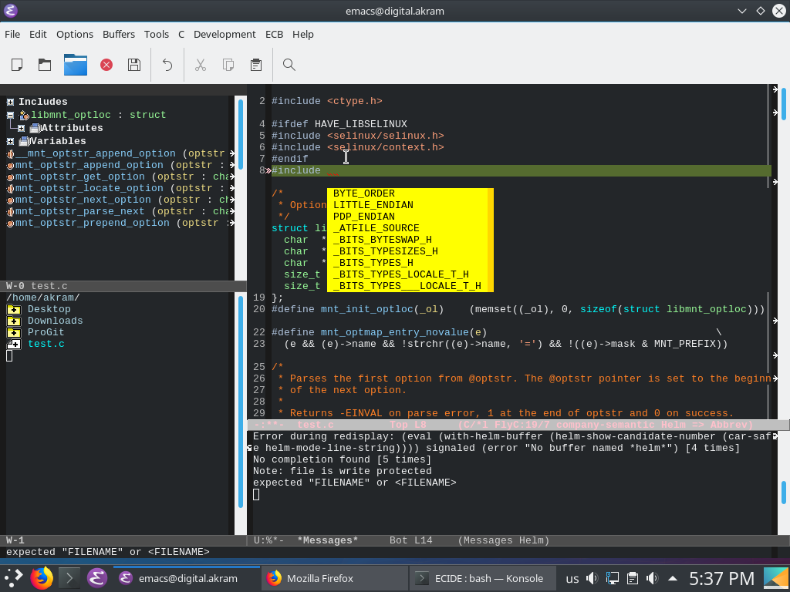

# ECIDE
ECIDE Customization to make `Emacs` Like C/C++ IDE.

## Features : 

1. Auto complete code
2. Auto complete header Files
3. Layout for methods and source browser
4. Line numbers
5. Error checker 
+ And more features 

## Dependencies :
This customization depends on these Packages:

1. aggressive-indent
2. company
3. company-c-headers
4. ecb
5. fill-column-indicato
6. flychecker
7. flycheck-color-mode-line

## Setup
After Installing dependencies
copy `.emacs` to your "path init file". 

